<!-- ===========================================================
     DEMO · Psychometric Tools + MLV Tools (Premio AEMCCO)
     Motor de 2026_07_08 (olas + pitas + tipografía), SIN buceo:
     depth bajo (0–0.15) = modo diurno/superficie.
     Estructura: portada · [Psychometric: hero+QR · landing · 3 tools]
                 · linaje · [MLV: hero+QR · landing · 4 tools] · contra.
     Capturas REALES con "tour" de hover (.tool-shot .hs = hotspots en %).
     QR CENTRADO (qr-hero) solo en las portadas de suite; contenido sin QR.
     Pies de figura ocultos (el ponente comenta). adv:N = auto-avance (tecla A).
     =========================================================== -->

--- depth:0 center portada adv:9

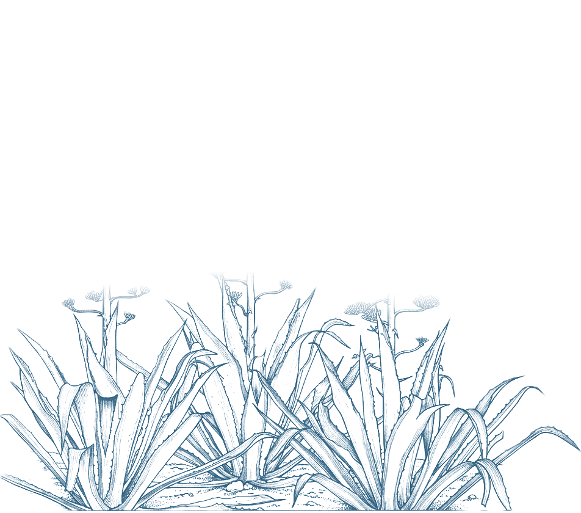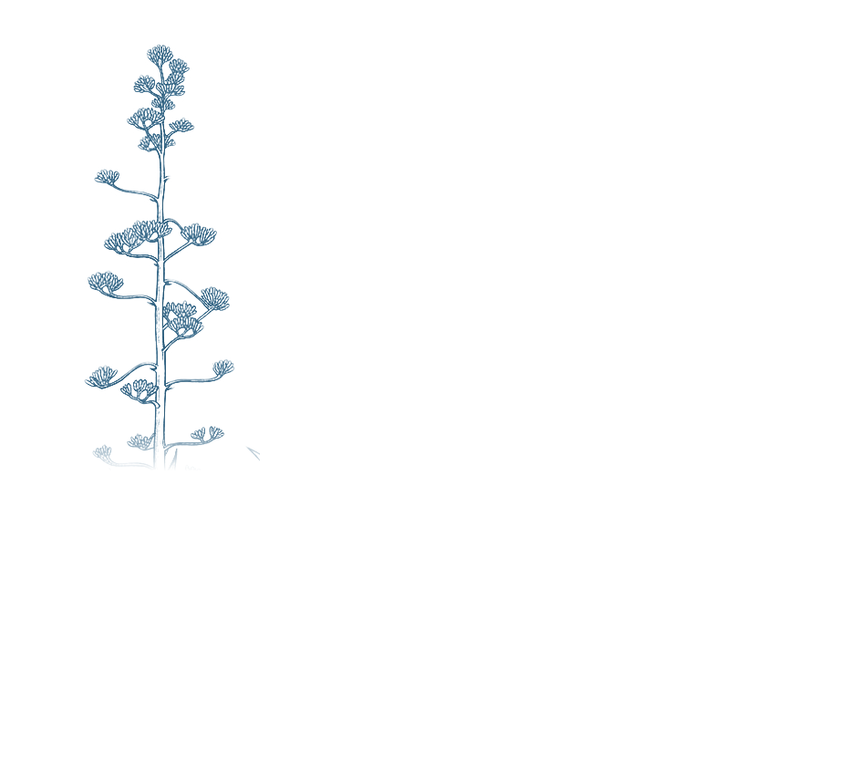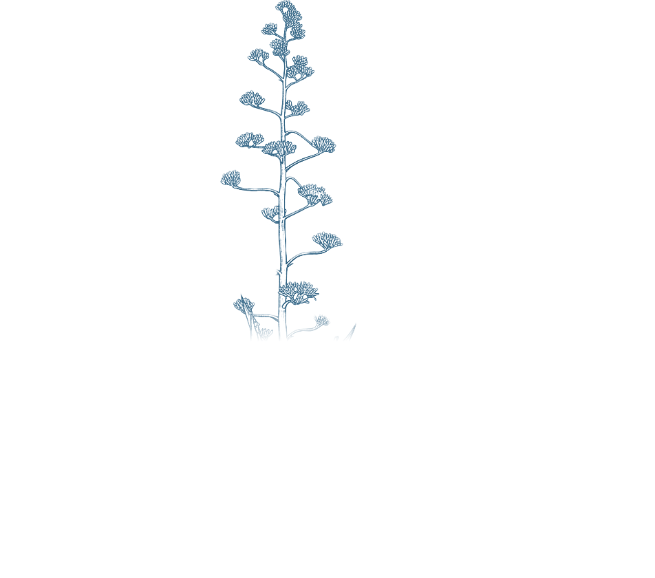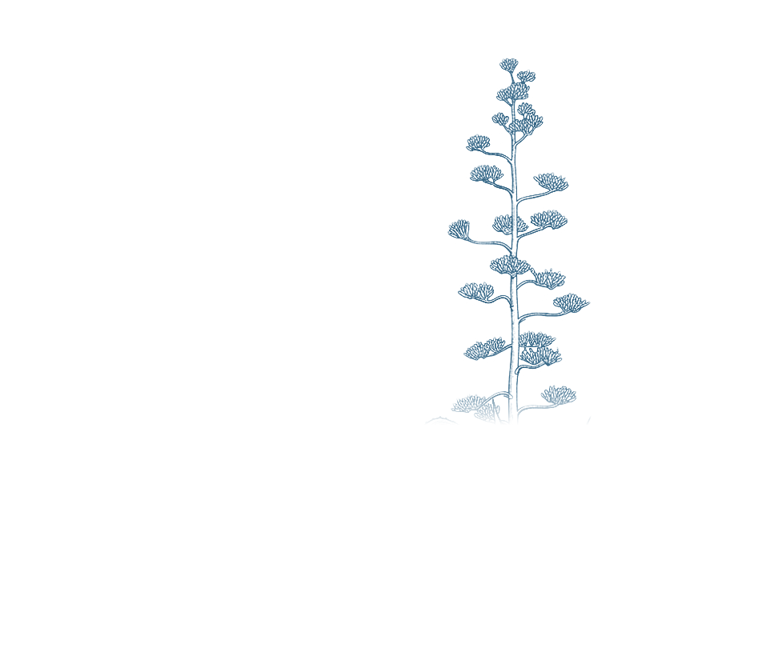

7–9 Julio 2026 · Universidad de Almería

🏆 Premio AEMCCO de divulgación y transferencia en metodología

Herramientas estadísticas y psicométricas

para investigadores en ciencias del comportamiento y en ingeniería

Alejandro Rujano · Enrique Heredia-Aguado

Universidad Nacional de Educación a Distancia (UNED) · Universidad Miguel Hernández de Elche (I3E)

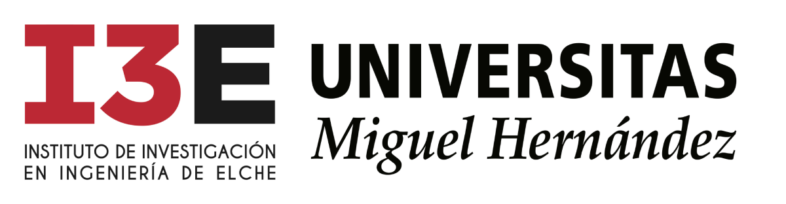

--- depth:0.05 nobrand center adv:7
> La suite premiada
# Psychometric Tools

Cada herramienta responde a una pregunta metodológica concreta — en el navegador, sin instalar nada.

psychometric-tools
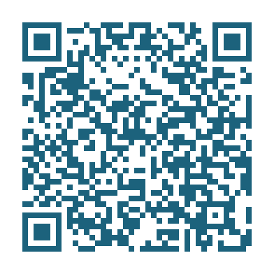

--- depth:0.06 nobrand wide adv:13
> Psychometric Tools 3 herramientas

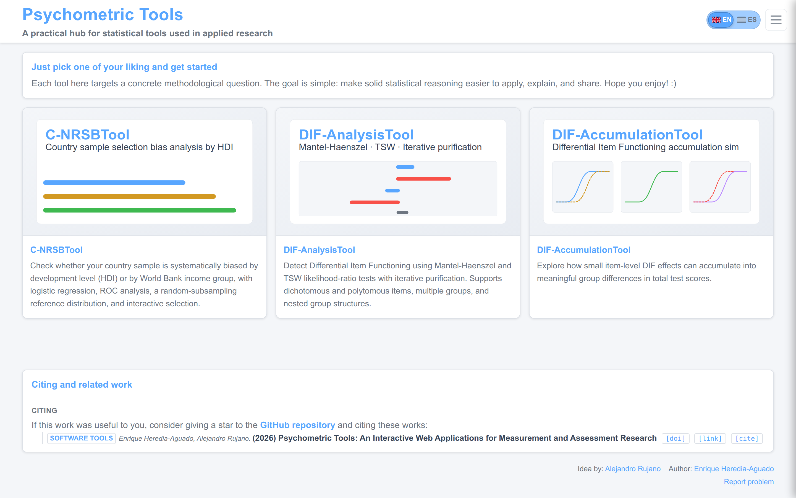
<b class="hs" data-x="2.78"  data-y="21.56" data-w="30.76" data-h="42.39" data-label="C-NRSBTool"></b>
<b class="hs" data-x="34.62" data-y="21.56" data-w="30.76" data-h="42.39" data-label="DIF-AnalysisTool"></b>
<b class="hs" data-x="66.46" data-y="21.56" data-w="30.76" data-h="42.39" data-label="DIF-AccumulationTool"></b>

--- depth:0.09 nobrand wide adv:15
> Psychometric Tools · C-NRSBTool · ¿tu muestra de países es representativa?

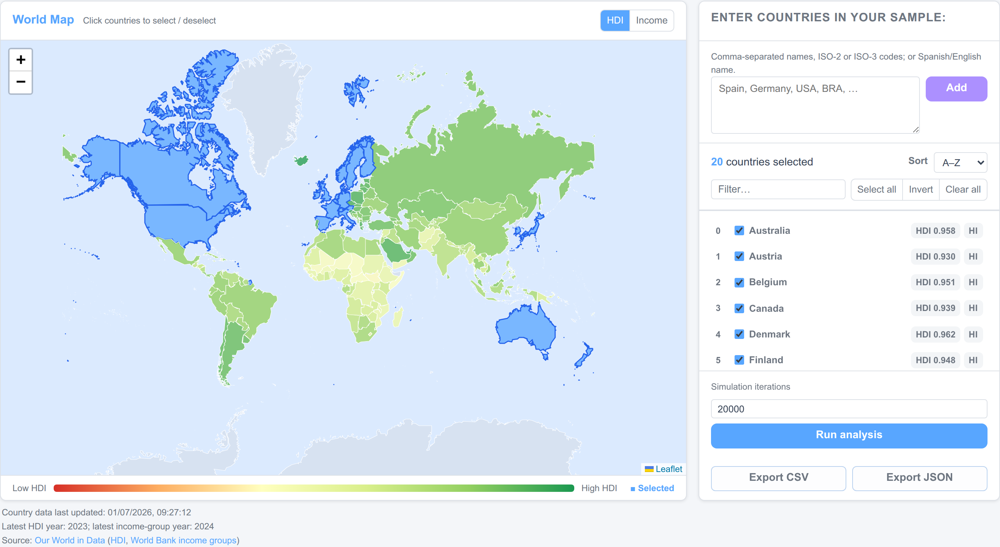
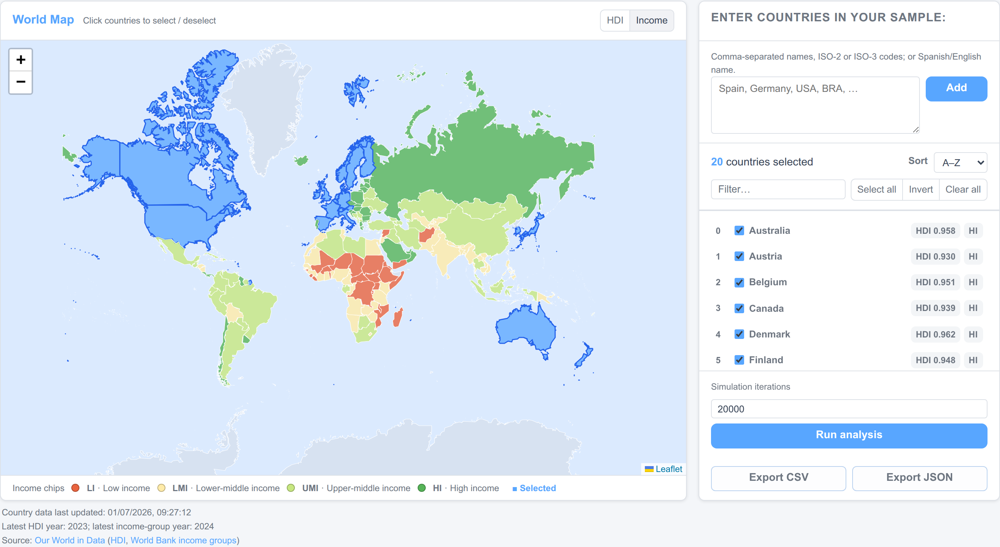
<b class="hs" data-x="0.1"  data-y="7.3"  data-w="68.5" data-h="79.5" data-label="Mapa interactivo (IDH)"></b>
<b class="hs" data-x="69.9" data-y="0"    data-w="30.1" data-h="91.4" data-label="Elige tu muestra de países"></b>
<b class="hs" data-x="71.1" data-y="77.3" data-w="27.6" data-h="4.6"  data-label="Ejecutar análisis"></b>
<b class="hs" data-x="60"   data-y="1.6"  data-w="7.4"  data-h="4"    data-label="Alterna IDH ↔ renta"></b>

--- depth:0.09 nobrand wide adv:10
> Psychometric Tools · C-NRSBTool · resultado IDH

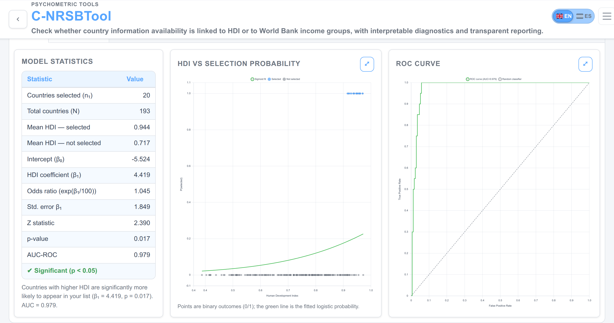

--- depth:0.09 nobrand wide adv:10
> Psychometric Tools · C-NRSBTool · resultado grupos de renta

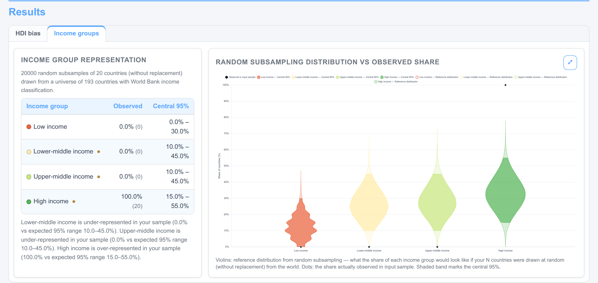

--- depth:0.11 nobrand wide adv:15
> Psychometric Tools · DIF-AnalysisTool · ¿un ítem funciona distinto entre grupos?

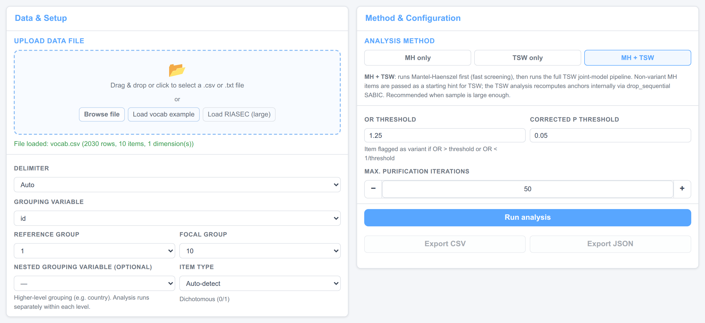
<b class="hs" data-x="0.9"  data-y="9.6"  data-w="48.4" data-h="38.2" data-label="Sube tu CSV (o carga un ejemplo)"></b>
<b class="hs" data-x="50.7" data-y="9.6"  data-w="48.4" data-h="23.1" data-label="Método: MH · TSW · MH+TSW"></b>
<b class="hs" data-x="50.7" data-y="32.7" data-w="48.4" data-h="30.5" data-label="Umbrales y purificación iterativa"></b>
<b class="hs" data-x="51.7" data-y="64.8" data-w="46.3" data-h="5.4"  data-label="Ejecutar análisis"></b>

--- depth:0.11 nobrand wide adv:11
> Psychometric Tools · DIF-AnalysisTool · resultado

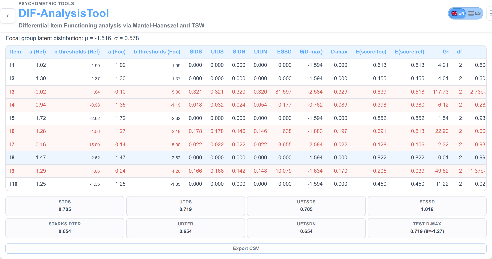

--- depth:0.13 nobrand wide adv:15
> Psychometric Tools · DIF-AccumulationTool · ¿qué pasa cuando lo pequeño se acumula?

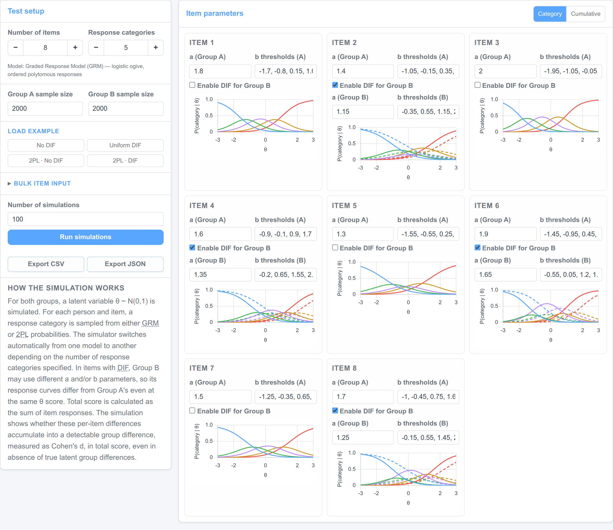
<b class="hs" data-x="0"    data-y="0"    data-w="27.9" data-h="14.8" data-label="Define el test"></b>
<b class="hs" data-x="0.1"  data-y="22.9" data-w="27.8" data-h="9.7"  data-label="Ejemplos: No DIF / DIF"></b>
<b class="hs" data-x="53.3" data-y="6.2"  data-w="22.5" data-h="29.8" data-label="Parámetros del ítem (a, b)"></b>

--- depth:0.13 nobrand wide adv:10
> Psychometric Tools · DIF-AccumulationTool · resultado

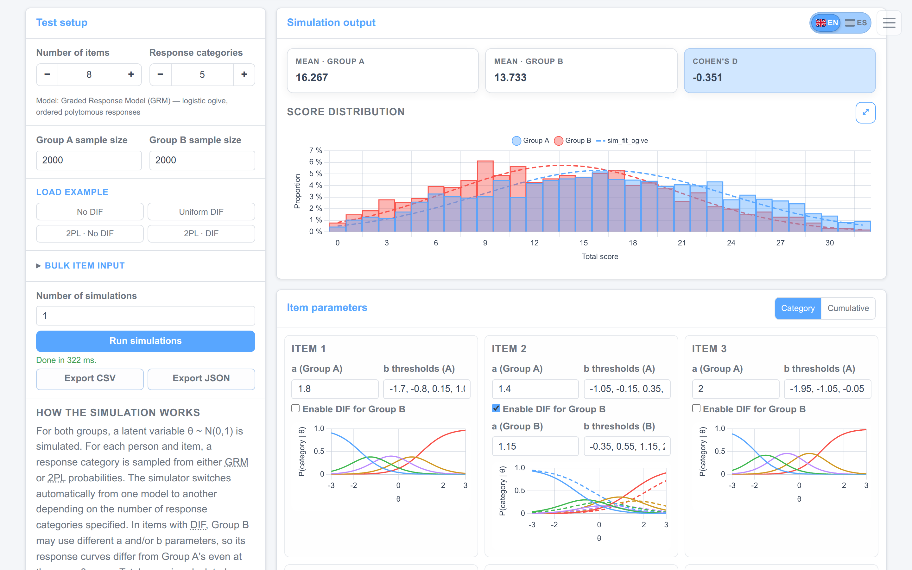

--- depth:0.15 nobrand center adv:9
> El linaje
## De medir personas a medir modelos

Psychometric Tools▸MLV Tools

El mismo tema de aplicaciones web, reforzado para el <b>análisis de la varianza</b> en aprendizaje automático.

--- depth:0.05 nobrand center adv:7
> La suite derivada
# MLV Tools

Las mismas preguntas de medición, ahora sobre modelos: ¿cuánto de un resultado es azar?

mlv-tools

--- depth:0.06 nobrand wide adv:13
> MLV Tools 4 herramientas

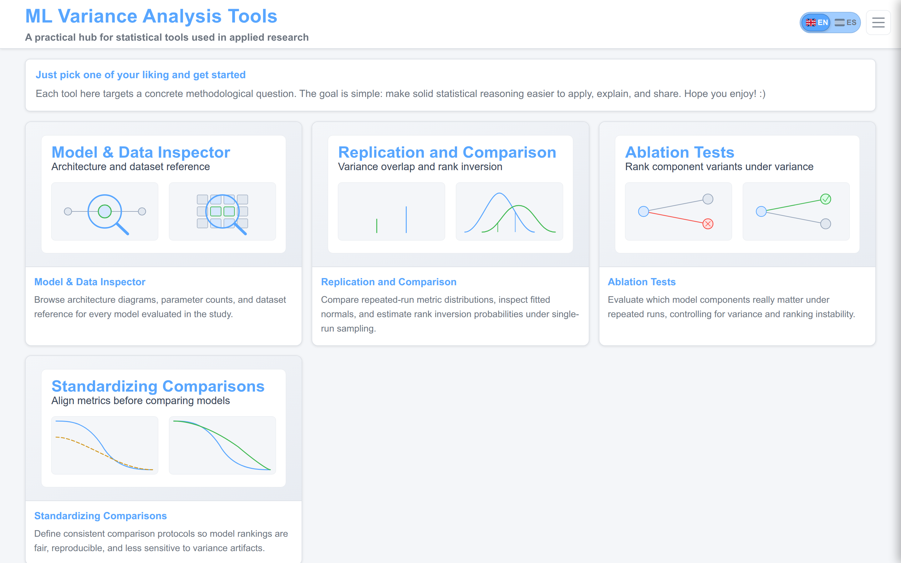
<b class="hs" data-x="2.78"  data-y="21.56" data-w="30.76" data-h="39.89" data-label="Model & Data Inspector"></b>
<b class="hs" data-x="34.62" data-y="21.56" data-w="30.76" data-h="39.89" data-label="Replication and Comparison"></b>
<b class="hs" data-x="66.46" data-y="21.56" data-w="30.76" data-h="39.89" data-label="Ablation Tests"></b>
<b class="hs" data-x="2.78"  data-y="63.11" data-w="30.76" data-h="36.4"  data-label="Standardizing Comparisons"></b>

--- depth:0.07 nobrand wide adv:9
> MLV Tools · Model & Data Inspector · ¿qué hay detrás de cada número?

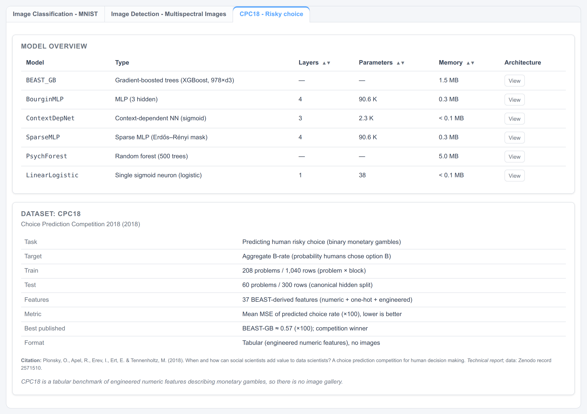
<b class="hs" data-x="39.7" data-y="1.5"  data-w="13.2" data-h="3.9"  data-label="Caso CPC18 · decisiones bajo riesgo"></b>
<b class="hs" data-x="2.1"  data-y="8.4"  data-w="95.8" data-h="38.4" data-label="Modelos: capas, parámetros, memoria"></b>
<b class="hs" data-x="2.1"  data-y="48.8" data-w="95.8" data-h="46.6" data-label="Dataset CPC18"></b>

--- depth:0.09 nobrand wide adv:9
> MLV Tools · Replication and Comparison · ¿y si repetimos el entrenamiento?

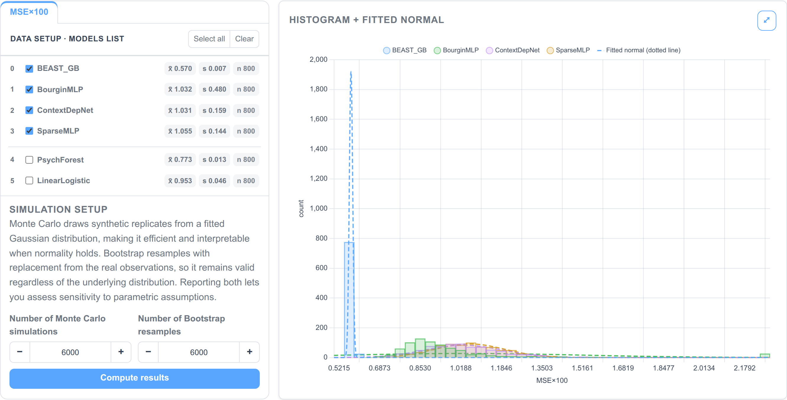
<b class="hs" data-x="0.8"  data-y="14.8" data-w="32.6" data-h="33.1" data-label="Modelos CPC18 (x̄, s, n)"></b>
<b class="hs" data-x="37"   data-y="9.2"  data-w="61.4" data-h="87.9" data-label="Histogramas + normal ajustada"></b>
<b class="hs" data-x="1.2"  data-y="92"   data-w="31.8" data-h="5"    data-label="Calcular resultados"></b>

--- depth:0.11 nobrand wide adv:9
> MLV Tools · Ablation Tests · ¿qué componente aporta de verdad?

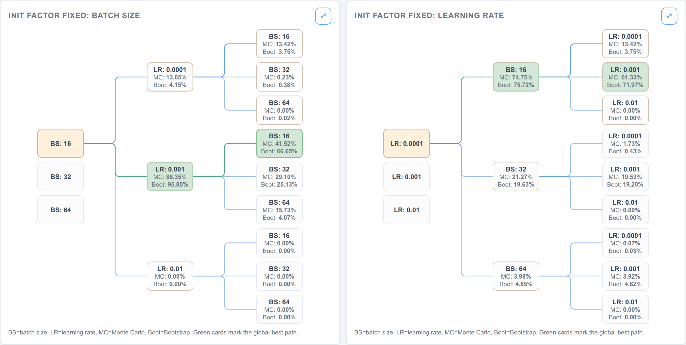
<b class="hs" data-x="0"    data-y="0"    data-w="49.6" data-h="98"   data-label="Fijando batch size"></b>
<b class="hs" data-x="50.4" data-y="0"    data-w="49.6" data-h="98"   data-label="Fijando learning rate"></b>
<b class="hs" data-x="21.4" data-y="37.3" data-w="22.7" data-h="18.1" data-label="El camino óptimo, en verde"></b>

--- depth:0.13 nobrand wide adv:9
> MLV Tools · Standardizing Comparisons · ¿cuántas repeticiones bastan?

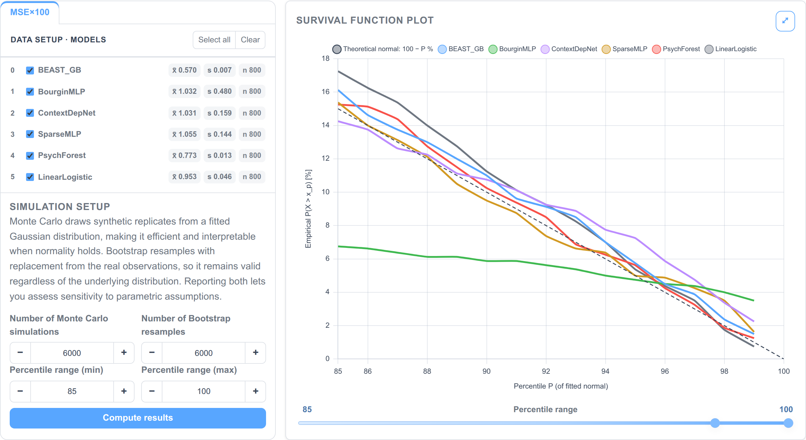
<b class="hs" data-x="0.8"  data-y="13.8" data-w="32.6" data-h="29"   data-label="Modelos CPC18 (x̄, s, n)"></b>
<b class="hs" data-x="37"   data-y="8.6"  data-w="61.4" data-h="81.7" data-label="Función de supervivencia"></b>
<b class="hs" data-x="37"   data-y="92"   data-w="61.4" data-h="6"    data-label="Rango de percentiles"></b>

--- depth:0 center portada adv:0

XIX Congreso de Metodología de las Ciencias Sociales y de la Salud · AEMCCO

🏆 Premio AEMCCO de divulgación y transferencia en metodología

Gracias

psychometric-tools

mlv-tools

Esta presentación
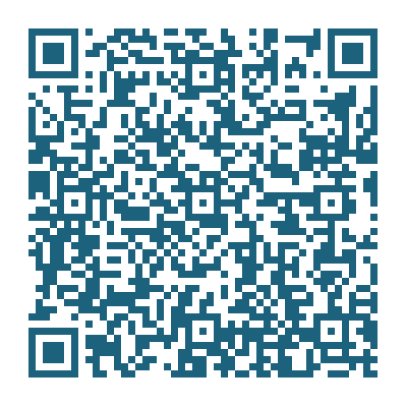

xalerujano@gmail.com

Herramientas estadísticas y psicométricas

Alejandro Rujano · Enrique Heredia-Aguado

UNED · Universidad Miguel Hernández de Elche (I3E)

